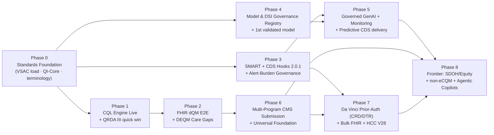

# Medgnosis — Roadmap to the World's Most Advanced Clinical Analytics & Decision-Support Platform

**Status:** Strategic roadmap · **Author:** generated for Dr. Sanjay Udoshi (Acumenus Data Sciences / Wellstack.ai) · **Date:** 2026-06-13
**Companion research:** [CDSS-RESEARCH-COMPENDIUM-2026.md](./CDSS-RESEARCH-COMPENDIUM-2026.md) — 8 fully-cited research streams (~192 sources)
**Inputs incorporated:** CMS Measure Inventory Export (508 active measures, 809 program-version pairings); HL7 FHIR QI-Core IG; eCQI QRDA versions; QDM v5.6 specification.

> **How this was produced.** A 20-agent deep-research workflow ran 8 parallel research streams (each *research → adversarial-deepen/verify*), 3 synthesis/gap-analysis lenses, and 1 roadmap-architecture pass — 1.88M research tokens, 542 tool uses, knowledge current to mid-2026. Every phase and epic below is grounded in the **actual Medgnosis codebase** (specific files, services, and migrations are named) and in the live standards landscape.

---

## 0. Executive Summary

Medgnosis is, today, an unusually capable **proprietary population-health analytics application** with a real-time care-gap engine, a 1M-patient hybrid OMOP/Kimball warehouse, a live CDS Hooks discovery surface, a well-modeled VSAC value-set bridge, and a clean, deliberately-laid CQL evaluator seam. It is **one architectural layer** away from being something the closed incumbents structurally cannot be: an **open-source (Apache 2.0), standards-native clinical-knowledge platform** that authors clinical logic **once** in CQL/QI-Core and serves it across three product surfaces — **certifiable quality measurement**, **payer-exchangeable prospective care gaps**, and **workflow-embedded decision support** — with **every measure and every model shipped behind a public, regulatory-grade transparency dossier** that no closed vendor will publish.

That missing layer is **standards-native, executable, shareable logic.** Medgnosis's measures are hand-authored SQL; its rules are an EAV "logic-as-data" engine; its FHIR is read-only and unprofiled; it has no CQL execution, no QRDA, no FHIR `MeasureReport`, no QI-Core conformance, and no trained predictive model. These are precisely the gaps that separate "an excellent analytics app" from "the most advanced clinical analytics and decision-support system in the world."

The strategy is **dependency-forced and wedge-driven**:

1. **Profile the FHIR layer to QI-Core and load VSAC first** (so CQL can bind and populations can resolve).
2. **Light up the CQL engine through the seam that already exists** (`measureEvaluator.ts`), adopting the battle-tested `cqframework/clinical-reasoning` engine rather than hand-building one.
3. Then everything downstream unlocks **in order**: FHIR `MeasureReport` + QRDA from one ELM run, Da Vinci DEQM prospective care gaps, SMART + CDS Hooks 2.0.1 conformance, a model-governance registry that gates *all* AI, externally-validated predictive models behind TRIPOD-AI/HTI-1 transparency, multi-program CMS submission, and Da Vinci prior-auth ahead of the CMS-0057-F deadlines.

**The wedge: incumbents cannot follow.** Epic/Cerner eCQM and risk engines are closed and EHR-locked; the open CQL stacks (`cqf-ruler`) are bare servers with no analytics, no UX, and no transparency product. Medgnosis can be the *single* platform that executes real CQL against **both** OMOP cohorts and FHIR populations, emits **both** legacy QRDA and FHIR `MeasureReport` from the same run (dQM-transition-native), re-expresses its care-gap engine as standards-conformant **prospective** gaps, and makes **radical transparency a shipped feature**. Because Medgnosis carries **zero opaque-model debt**, transparency is a free strategic asset, not a cost — and it attacks exactly the seam (Epic Sepsis Model, EDI, Rothman opacity) the incumbents cannot close.

---

## 1. Vision & Positioning

### 1.1 Vision

> Make Medgnosis the world's most advanced clinical analytics and decision-support platform by being the only **open-source, standards-native** system that authors clinical logic **once** in CQL/QI-Core and serves it across **certifiable quality measurement** (eCQM/dQM, QRDA + FHIR `MeasureReport`, multi-program CMS submission), **payer-exchangeable prospective care gaps** (Da Vinci DEQM), and **workflow-embedded decision support** (CDS Hooks 2.0.1 + SMART) — over a 1M-patient hybrid OMOP/FHIR warehouse, with **every predictive model and every AI answer shipped behind a public, regulatory-grade transparency dossier** (TRIPOD-AI + ONC HTI-1 DSI).

### 1.2 Positioning thesis (the wedge)

Medgnosis already holds the hardest, most differentiating assets — a 1M-patient / 195M-procedure EDW + Kimball star, a 45-bundle / 354-measure real-time care-gap engine, a role-aware VSAC bridge (migrations `050`–`052`), a live CDS Hooks discovery surface, and a clean CQL evaluator seam (`apps/api/src/services/measureEvaluator.ts`, whose `'cql'` path throws a pointer to the `cqf-ruler` bridge spec). What it lacks is exactly **one architectural layer: standards-native, executable, shareable logic.**

The incumbents are **structurally unable to follow** into the open, standards-native, transparent niche:

| Competitor class | Why they can't occupy Medgnosis's wedge |
|---|---|
| Epic / Oracle-Cerner eCQM & risk engines | Closed, EHR-locked; cannot be the open, self-hostable, OMOP+FHIR reference implementation; cannot publish override rates or model dossiers without indicting their own black boxes. |
| Open CQL stacks (`cqf-ruler`, `fqm-execution`) | Bare execution servers — no population analytics, no UX, no transparency product, no multi-program submission routing. |
| PHM/quality vendors (Arcadia, Innovaccer, Health Catalyst, Cotiviti, Inovalon) | Proprietary measure libraries; retrospective gap closure; transparency is not a shipped artifact. |
| Knowledge vendors (UpToDate, ClinicalKey AI, Micromedex) | Closed corpora; reference-only; no measurement/CDS execution substrate. |

### 1.3 Six strategic pillars

1. **One computable-knowledge substrate.** Author clinical logic once in CQL+ELM against QI-Core, package as FHIR `Library`/`Measure`/`PlanDefinition`, and serve it to quality measurement, care gaps, and CDS from a single embedded clinical-reasoning engine. Retire the dual non-portable representations (bespoke SQL in `measureCalculatorV2.ts`; free-text `VARCHAR` criteria in `measure_definition`) as *canonical*; keep them as fast-path caches reconciled against the authoritative CQL result.
2. **Standards-native and dQM-transition-native.** Be conformant to the *live* standards (CQL 1.5.3, QI-Core 7.0.2, US Core 7.0.0, CDS Hooks 2.0.1, SMART 2.2.0, DEQM 5.0.0, CQFM 5.0.0) and emit **both** legacy QRDA Cat I/III **and** FHIR `MeasureReport` from the same engine run — selling "submit to any CMS program in either format, before and after the cutover" as a single capability while the market is mid-migration.
3. **Radical, shippable transparency.** Turn the existing logic-as-data + components-JSONB explainability instinct into regulatory-grade, user-visible artifacts: per-measure **dossiers** (CQL / ELM / VSAC version pins / test-deck coverage / `MeasureReport`) and per-model **TRIPOD-AI dossiers** + **ONC HTI-1 DSI 31-attribute "nutrition labels."** Make "every measure and every model is proven and labeled" the marketing thesis.
4. **Author once, report to many programs.** Build a program-version pairing layer (seeded from the 508-measure / 809-pairing CMS inventory) so one CQL artifact routes to MIPS, Hospital IQR, Medicaid Adult/Child Core Sets, MSSP/APP, and the **Universal Foundation** set with the correct collection method (claims vs eCQM) and submission format — then extend to non-eCQM families (HEDIS/ECDS Stars, APM models EOM/KCC/ACO REACH/GUIDE).
5. **Governed AI, no black-box debt.** Ground every generative answer on a curated corpus with per-claim citation traceability and refuse-on-low-confidence; gate every predictive model behind a validation dossier (AUROC + calibration + decision-curve net benefit + subgroup/fairness) and DECIDE-AI silent-mode evaluation before it can fire a single CDS card. Deliver predictive output through CDS Hooks with a closed `/feedback` loop so alert burden and model value are *measured*, not asserted.
6. **Embedded in the regulated workflow.** Adopt SMART App Launch + asymmetric JWT so Medgnosis can be launched by and embedded in EHRs, then pilot Da Vinci CRD/DTR prior-auth provider tooling **ahead of** the CMS-0057-F deadlines (provisions Jan 1 2026; production Jan 1 2027) — converting the existing order-sign hook into a funded, regulation-driven product.

---

## 2. Where Medgnosis Stands Today — Honest Current-State Assessment

A standards-axis audit of the codebase yields a deliberately unflattering but accurate baseline. (Full evidence: gap-analysis lenses in the companion compendium and the synthesis below.)

### 2.1 Capability inventory (what is real)

- **Warehouse:** `phm_edw` (23 normalized tables — patient 1M+, encounter 28.7M, condition_diagnosis 42.4M, procedure_performed 195M, observation, medication, vitals, immunization, allergy) + `phm_star` (Kimball: `dim_measure` 399, `fact_measure_result`, `fact_measure_strata`, `fact_patient_bundle`). **Genuine, differentiating, hard-to-replicate.**
- **Measure surface:** ~753 `measure_definition` rows (45 with CMS codes), Wilson 95% CIs (`wilsonCI.ts`), age/sex strata (migration `051`), nightly BullMQ batch.
- **Care gaps:** 45 condition bundles / 354 bundle measures / 30 dedup rules, real-time WebSocket updates, patient-level care-bundle composition.
- **CDS surface:** live `{base}/cds-services` discovery doc with two services — `medgnosis-care-gaps` (order-sign) and `medgnosis-problem-list` (patient-view) — returning well-formed Cards.
- **Value sets:** role-aware VSAC bridge (`vsacService.ts`, migrations `050`/`051`/`052`): 1,545 value sets / 225k codes / 72 CMS measures, version-drift detection, careful EDW↔VSAC code-system translation. **The best eCQM scaffolding in the codebase.**
- **FHIR R4 (read-only):** Patient/Condition/Observation/MedicationRequest + `$everything`.
- **Risk & scores:** a 7-factor hand-weighted heuristic (`riskScoring.ts`), published clinical scores (`riskModels/`: CHA₂DS₂-VASc, Gail), and MEWS/NEWS2 (`ewsEngine.ts`).
- **The seam:** `measureEvaluator.ts` defines `MeasureEvaluator` with a `'cql'` path that throws a pointer to the `cqf-ruler` bridge spec — **the CQL insertion point is pre-built.**

### 2.2 Honest maturity scoring

| Lens | Score | One-line verdict |
|---|---|---|
| **Standards-based quality measurement & reporting** | **≈ 1.0 / 5** | Value sets in place; *everything downstream is bespoke and non-portable.* `measureCalculatorV2.ts` aggregates a pre-computed `gap_status` column — it does **not** evaluate measure logic. Canonical logic is free-text `VARCHAR(2000)`. No CQL, no QRDA, no `MeasureReport`, no QI-Core. |
| **CDS depth & interoperability** | **One layer below standards-native** | A real CDS Hooks discovery surface, but pre-2.0.1: no `/feedback`, no `overrideReasons`, no `systemActions`, inbound `fhirAuthorization` never verified (services mounted with no auth), labeled "2.0". FHIR unprofiled; symmetric JWT cannot satisfy SMART/CDS Hooks asymmetric requirements. |
| **AI/ML & responsible-AI governance** | **≈ 1.5 / 10** | **Zero trained ML models.** Everything labeled "risk/predictive" is a heuristic or a published score. Generative layer is ungrounded, uncited, no refusal gating, writing LLM JSON straight to `ai_insights`. No model registry metrics, no calibration/fairness/drift, no HTI-1 DSI labels, no FDA scope statement. *But uniquely positioned to lead on transparency — no opaque-model debt to defend.* |

### 2.3 The three load-bearing truths

1. **There is no measure-logic execution.** `measureCalculatorV2.ts` reads `gap_status` off `fact_patient_bundle_detail` and maps it to flags. The clinical logic lives upstream as hand-authored SQL (archived under `archive/backend/database/Measures/CMS*.sql`). The "SQL-based eCQM execution" claim is really *gap-status rollup.*
2. **The canonical measure logic is not computable.** `phm_edw.measure_definition` stores numerator/denominator/exclusion criteria as free-text `VARCHAR(2000)` — the Arden-era "curly-braces" non-portability trap, with no eCQM identifier, version, period binding, or QDM/QI-Core mapping.
3. **There is zero digital-quality plumbing.** A whole-tree grep for `CQL`/`QRDA`/`MeasureReport`/`$evaluate-measure`/`QI-Core`/`clinical-reasoning` returns exactly one non-test hit: the throwing `'cql'` stub.

---

## 3. Gap Analysis — Three Lenses

The 13 + 11 + 9 prioritized gaps from the synthesis, distilled. Severity reflects strategic blast radius, not difficulty.

### 3.1 Lens A — Standards-based quality measurement & reporting

| # | Gap | Severity |
|---|---|---|
| A1 | No CQL/ELM execution engine — the `'cql'` path is a throwing stub; measure logic is never evaluated | **Critical** |
| A2 | Measure logic is non-computable free text (`VARCHAR(2000)`), not CQL — unversioned, unsharable, unauditable | **Critical** |
| A3 | No QRDA Cat I or III export — cannot submit to *any* CMS program electronically | **Critical** |
| A4 | No FHIR dQM plumbing — no `Measure`/`MeasureReport`, no `$evaluate-measure` | **Critical** |
| A5 | No QI-Core / US Core conformance — bare R4, binary-only gender (data-loss bug), no `meta.profile` | High |
| A6 | VSAC data not loaded; OIDs not wired to executable logic or a terminology `$expand` | High |
| A7 | No measure test decks (Bonnie/MADiE/Cypress) — measures are *unproven* | High |
| A8 | No Da Vinci DEQM / standards-conformant Gaps-in-Care | High |
| A9 | No reporting-period / measure-version / program-binding model | High |
| A10 | No multi-program mapping layer — one measure cannot route to its 1–9 programs | Medium |
| A11 | No HEDIS/Stars or APM-model (EOM/KCC/ACO REACH/GUIDE) measure semantics | Medium |
| A12 | No Bulk FHIR `$export` to ingest external measurement populations | Medium |

### 3.2 Lens B — CDS depth & interoperability

| # | Gap | Severity |
|---|---|---|
| B1 | No CQL/ELM engine — logic is non-portable SQL + non-exportable EAV (Arden trap) | **Critical** |
| B2 | FHIR layer not US Core/QI-Core profiled and read-only (no write-back for CDS suggestions) | **Critical** |
| B3 | CDS Hooks pre-conformant: no `/feedback`, no `overrideReasons`, no `systemActions`, inbound `fhirAuthorization` unverified | High |
| B4 | No SMART App Launch; symmetric (HS256) JWT that CDS Hooks/SMART prohibit | High |
| B5 | No FHIR Clinical Reasoning resources/operations (`Library`/`PlanDefinition`/`$apply`/`$evaluate-measure`/`$care-gaps`) | High |
| B6 | No QRDA / `MeasureReport` — cannot submit despite a 753-row catalog | High |
| B7 | No Da Vinci IGs (DEQM, CRD/DTR/PAS, CDex) despite a CDS Hooks substrate one step from CRD | High |
| B8 | No alert-burden instrumentation/governance (override telemetry, tiering, suppression, dashboard) | Medium |
| B9 | No CPG-on-FHIR evidence grading (GRADE provenance on interventions) | Medium |
| B10 | VSAC load pending + no terminology service | Medium |

### 3.3 Lens C — AI/ML & responsible-AI

| # | Gap | Severity |
|---|---|---|
| C1 | No model governance/validation infrastructure (no TRIPOD-AI dossier, no AUROC/calibration/Brier/net-benefit storage, no intended-use metadata) | **Critical** |
| C2 | No trained predictive ML models of any kind; flagship "risk score" is a hand-weighted heuristic with no outcome target or validation | High |
| C3 | No post-deployment monitoring (drift, recalibration, subgroup/fairness surveillance, PCCP-style change control) | High |
| C4 | No ONC HTI-1 DSI source-attribute "nutrition labels" (31 attributes) | High |
| C5 | Generative AI is ungrounded and uncited — no RAG, no citation traceability, no confidence/refusal gating; LLM JSON written straight to `ai_insights` | High |
| C6 | No fairness/equity evaluation anywhere | High |
| C7 | No FDA Non-Device CDS scope statement / SaMD boundary documentation | Medium |
| C8 | No prospective / silent-mode (DECIDE-AI) evaluation harness | Medium |
| C9 | Model output not delivered through standards rails with closed-loop feedback | Medium |

---

## 4. The Roadmap — Nine Phases

Phases are sequenced by **dependency**, not calendar. Several run in parallel once Phase 0 lands. Durations are engineering estimates for a small senior team; the whole program is roughly an **18–24 month** arc, with the first CMS-submittable artifact (QRDA III) achievable inside the first ~4 months.

### 4.1 Dependency graph

**Parallelization.** After Phase 0: the **quality track** (P1 → P2 → P6) and the **CDS+AI track** (P3, P4 → P5) proceed concurrently; they converge for prior-auth (P7) and the frontier (P8).

---

### Phase 0 — Standards Foundation: VSAC Load, QI-Core Profiling, Terminology Service
**Goal.** Lay the two hard prerequisites for everything downstream — authoritative versioned value sets that resolve, and a FHIR data layer that QI-Core-authored CQL can actually bind to — while fixing the data-loss bugs that make the FHIR layer non-conformant.
**Duration.** 6–8 weeks · **Depends on.** — · **Closes.** A6, A5, B2, B10

**Epic 0.1 — Load VSAC data and stand up a terminology service.** Execute the pending VSAC load into the existing `vsac_*` tables; expose FHIR `$expand`/`$validate-code` with per-reporting-period version pins and a pre-expanded expansion cache; wire `version_drift` alerting off `getMeasureBridgeStatus`.
- *Deliverables:* VSAC load complete (1,545 value sets / 225k codes / 72 CMS measures) + annual re-ingestion script; `$expand`/`$validate-code` endpoints; expansion-cache table keyed by OID + measurement period; drift alerting.
- *Standards:* VSAC, FHIR Terminology `$expand`/`$validate-code`, SVS.
- *Touchpoints:* `vsacService.ts`, migrations `050`/`051`/`052`, `scripts/load-vsac.sh`, `apps/api/src/routes/value-sets`.

**Epic 0.2 — Profile the FHIR R4 layer to US Core 7.0.0 and map to QI-Core 7.0.2.** Populate `meta.profile`; **fix the binary-gender data-loss bug** (`mappers.ts` collapses everything non-male to `'female'`); replace the `medgnosis.example.com` placeholder base URL; add US Core race/ethnicity/birthsex extensions and required Must-Support elements; publish a `CapabilityStatement` and `.well-known/smart-configuration`.
- *Deliverables:* QICore-ModelInfo 7.0.2 path-conformance test harness (a known CMS measure as oracle); `mappers.ts` emitting valid `meta.profile` + full gender value set; US Core Patient extensions; `$metadata`; CI gate running `validator_cli.jar` against QI-Core 7.0.2 / US Core 7.0.0.
- *Standards:* US Core 7.0.0, QI-Core 7.0.2, FHIR R4 4.0.1, USCDI v4, `CapabilityStatement`.
- *Touchpoints:* `apps/api/src/services/fhir/mappers.ts`, `apps/api/src/routes/fhir`.

**Epic 0.3 — OMOP/EDW → QI-Core projection mapping.** Map `phm_edw` columns to the **exact** primary code/date paths QICore-ModelInfo 7.0.2 declares (not just any FHIR shape), with `concept_id` → source-code → VSAC-membership resolution and the QI-Core **negation pattern** (`status=not-done`+`statusReason`; `doNotPerform=true`+`reasonCode`).
- *Standards:* QI-Core 7.0.2, OMOP CDM v5.4, `qicore-negation-reason` ValueSet.
- *Touchpoints:* migration `001_phm_edw_schema.sql`, `fhir/mappers.ts`, `omopExport.ts`.

**Success criteria.** `validator_cli.jar` passes on Patient/Condition/Observation/MedicationRequest against QI-Core 7.0.2 in CI · `$expand` returns version-pinned expansions for the top 10 CMS measure value sets · gender data-loss bug eliminated · a CMS-published QI-Core eCQM's CQL retrieves resolve against projected EDW data in a smoke test.

---

### Phase 1 — CQL Engine Live + First Proven Measures + QRDA III Quick Win
**Goal.** Convert Medgnosis from gap-status rollup to **real measure computation** by lighting up the existing CQL seam with an embedded clinical-reasoning engine, prove the top eCQMs against test decks, and ship the lowest-effort/highest-value CMS submission artifact (QRDA Cat III).
**Duration.** 8–10 weeks · **Depends on.** Phase 0 · **Closes.** A1, A2, A3 (partial), A7

**Epic 1.1 — Embed the clinical-reasoning engine behind the `measureEvaluator` `'cql'` seam.** Implement the throwing `'cql'` path by embedding `cqframework/clinical-reasoning` (JVM sidecar) or `fqm-execution` (JS) loading the 7.0.2-matched QICore-ModelInfo + FHIRHelpers/QICoreCommon. **No caller or schema change**; SQL stays the gated fallback via `MEASURE_EVALUATOR`. Compile CQL → ELM in CI with a pinned translator; check ELM into the measure repo.
- *Deliverables:* `cqlMeasureEvaluator` wired to a runtime; `MEASURE_EVALUATOR=cql` executes 2–3 measures end-to-end; CI CQL→ELM compilation; SQL-vs-CQL reconciliation drift check per period.
- *Standards:* CQL 1.5.3, ELM, FHIRHelpers/QICoreCommon, FHIR Clinical Reasoning.
- *Touchpoints:* `measureEvaluator.ts`, `measureCalculatorV2.ts`, `workers/measure-calculator.ts`, `docs/superpowers/specs/2026-06-12-parthenon-ecqm-handoff.md` (§6.3).

**Epic 1.2 — Author/prove the top ~10 eCQMs as CQL with test decks.** **Ingest CMS-published FHIR eCQM content** (`ecqm-content-qicore-2025`) rather than re-authoring; for the top MIPS/multi-program measures (CMS122 HbA1c, CMS165 BP control, CMS130 colorectal, CMS125 breast) attach MADiE/Bonnie-style test decks proving numerator/denominator/exclusion coverage.
- *Deliverables:* 10 eCQMs executing as CQL `Library`s with passing test decks; per-measure dossier scaffold (CQL + ELM + VSAC OID pins + coverage report); test decks ingested as CI fixtures.
- *Touchpoints:* migration `054`, `apps/api/src/routes/measures`, `apps/web/src/pages/MeasuresPage.tsx`.

**Epic 1.3 — Re-model measure logic as FHIR `Library`/`Measure`.** Replace the free-text `VARCHAR(2000)` criteria as *canonical* with FHIR `Library` (CQL+ELM) + `Measure` artifacts carrying eCQM identifiers, versions (`CMSxxxvN`), and reporting-period bindings; keep the EDW row as a display/index cache.
- *Standards:* FHIR `Library`, FHIR `Measure`, CQFM 5.0.0, CRMI, eCQM identifiers.
- *Touchpoints:* migration `001` (`measure_definition`), migration `012` (`quality_reporting_period`), migration `013` (`dim_measure`).

**Epic 1.4 — QRDA Category III aggregate serializer (near-term win).** Year-keyed QRDA Cat III writer mapping `fact_measure_result` rollups and `fact_measure_strata` per-dimension counts onto `aggregateCount` observations under `measureReference` organizers, validated against **Cypress CVU+** in CI. Lowest effort; unlocks MIPS/APP eCQM submission *today*.
- *Deliverables:* QRDA Cat III XML serializer (configurable eCQI IG version per reporting year); QPP JSON export for MIPS/APP; Cypress CVU+ validation in CI.
- *Touchpoints:* migration `013` (`fact_measure_result`), migration `051` (`fact_measure_strata`), `measureCalculatorV2.ts`.

**Success criteria.** ≥10 eCQMs compute identical populations under CQL and pass their test decks · CQL and SQL agree within tolerance on reconciliation · a valid QRDA Cat III file passes Cypress CVU+ · each proven measure has a published dossier retrievable via API.

---

### Phase 2 — FHIR dQM End-to-End + Standards-Conformant Care Gaps (DEQM)
**Goal.** Become a true digital-quality-measure *producer*: emit FHIR `Measure`/`MeasureReport` via `$evaluate-measure`, generate QRDA Cat I patient-level files, and re-express the proprietary WebSocket care-gap engine as payer-exchangeable **Da Vinci DEQM Gaps-in-Care** with prospective detection.
**Duration.** 8–10 weeks · **Depends on.** Phase 1 · **Closes.** A4, A8, B5, B6, B7 (partial)

**Epic 2.1 — `$evaluate-measure` → FHIR `MeasureReport`, wired into the nightly batch.** Expose `$evaluate-measure` producing individual/subject-list/summary `MeasureReport`s from the CQL run, written into the nightly BullMQ batch alongside the star rollup; add QRDA Cat I patient-level export from the **same ELM run**.
- *Standards:* FHIR `MeasureReport`, `$evaluate-measure`, CQFM 5.0.0, QRDA Cat I, Da Vinci DEQM 5.0.0.
- *Touchpoints:* `workers/measure-calculator.ts`, `measureEvaluator.ts`, `routes/measures`.

**Epic 2.2 — Da Vinci DEQM Gaps-in-Care with prospective "gaps through period."** Re-project the 45-bundle / 354-measure engine into DEQM 5.0.0 `$care-gaps` returning Gaps-In-Care Bundles (`Composition` + individual `MeasureReport`s + `DetectedIssue` with Gap Status), including **prospective open-gap detection**, preserving the live WebSocket UX as a parallel emission.
- *Standards:* Da Vinci DEQM 5.0.0, `$care-gaps`, FHIR `MeasureReport`, `DetectedIssue`.
- *Touchpoints:* migrations `006`/`007`, `measureCalculatorV2.ts`, `routes/care-gaps`, `routes/bundles`, `BundlesPage.tsx`.

**Epic 2.3 — Per-measure dossier as a published transparency artifact.** Bundle CQL source + ELM + VSAC OIDs (version-pinned) + test-deck coverage + computed `MeasureReport` into a published, API-queryable dossier per measure version.
- *Deliverables:* `GET /measures/{code}/dossier`; public dossier index in `MeasuresPage`; version-pinned provenance.
- *Touchpoints:* `routes/measures`, `MeasuresPage.tsx`, `vsacService.ts`.

**Success criteria.** `$evaluate-measure` returns valid DEQM `MeasureReport`s for all proven measures · `$care-gaps` returns a valid Gaps-In-Care Bundle including ≥1 prospective gap · QRDA Cat I files pass Cypress · every proven measure exposes a complete dossier.

---

### Phase 3 — SMART App Launch, CDS Hooks 2.0.1 Conformance, Alert-Burden Governance
**Goal.** Make Medgnosis embeddable in the clinician workflow and **close the CDS feedback loop**: adopt asymmetric-auth SMART App Launch, bring CDS Hooks to full 2.0.1 conformance with a measured `/feedback` loop, and ship the open alert-burden dashboard that turns the override-rate problem into a marketing wedge.
**Duration.** 8–10 weeks · **Depends on.** Phase 0 · **Closes.** B3, B4, B8, C9 (substrate)

> **Auth-system guardrail.** Per `.claude/rules/auth-system.md`, the protected app-user auth flow (login/register/`must_change_password`, JWT payload, ChangePasswordModal, Resend temp-password delivery) is production-deployed and **MUST NOT** be altered. All SMART/asymmetric work here is **additive** — a separate authorization server for the FHIR/CDS surfaces only.

**Epic 3.1 — SMART App Launch 2.2.0 + asymmetric JWT for FHIR/CDS surfaces.** OAuth2 EHR + standalone launch, granular v2 scopes, launch context, PKCE, asymmetric ES384/RS384 client auth, and `.well-known/smart-configuration` — **augmenting, not replacing** the app-user flow.
- *Standards:* SMART App Launch 2.2.0, OAuth2, SMART Backend Services, PKCE.
- *Touchpoints:* `plugins/auth.ts`, `routes/fhir`, `routes/cds-hooks/index.ts`, `.claude/rules/auth-system.md`.

**Epic 3.2 — CDS Hooks 2.0.1 conformance + closed feedback loop.** Add `POST /cds-services/{id}/feedback` persisting accepted/overridden + `overrideReason` + `outcomeTimestamp` to a first-class alert-burden table; add `overrideReasons` to interruptive Cards; add `systemActions`; **verify inbound `fhirAuthorization` JWT signatures** (services currently mounted with no auth); add the third service (order-select); relabel `2.0` → `2.0.1`.
- *Standards:* CDS Hooks 2.0.1, Hook Maturity Model, AHRQ CDS Five Rights, GUIDES.
- *Touchpoints:* `routes/cds-hooks/index.ts`, `routes/alerts`, migration `005`.

**Epic 3.3 — Alert-burden governance and open dashboard.** Per-site/per-user suppression (AlertSpace pattern), severity tiering, patient-specific filtering (Navigo pattern), default-non-interruptive cards, and a **public alert-burden dashboard** — Bates' "monitor and respond," operationalized, which no incumbent publishes.
- *Touchpoints:* `routes/alerts`, `rulesEngine.ts`, `AlertsPage.tsx`, migration `039`.

**Success criteria.** A SMART app launches against the FHIR server with granular scopes + asymmetric auth · CDS Hooks discovery + services pass a 2.0.1 conformance check; `/feedback` persists override reasons · alert-burden dashboard reports accepted/overridden rates per service · no CDS service runs unauthenticated.

---

### Phase 4 — Model & DSI Governance Registry + First Externally-Validated Predictive Model
**Goal.** Establish the responsible-AI keystone — a regulatory-grade model registry and HTI-1 DSI labeling that **gates all ML** — then ship the first genuinely trained, externally-validated, calibrated predictive model (30-day readmission) *only after* it passes the registry's validation gate.
**Duration.** 10–12 weeks · **Depends on.** Phase 0 · **Closes.** C1, C2, C4, C6, C7, C8 (harness in P5)

**Epic 4.1 — Model & DSI Governance Registry (the keystone, buildable before any ML).** Extend `phm_star.dim_risk_model` and add `phm_edw.model_validation` storing per `model_code`+version: intended use, training population, AUROC, calibration-in-the-large + slope, Brier, decision-curve net benefit, subgroup/fairness metrics, external/temporal validation status, and the full **ONC HTI-1 DSI 31 source attributes**. Expose `GET /models/{code}/card` (TRIPOD-AI dossier) and `/models/{code}/dsi-label`, surfaced inline on every risk/CDS output. **Immediately documents the existing 7-factor heuristic and published scores honestly** (relabel the heuristic a "stratification heuristic," not a "predictor").
- *Standards:* TRIPOD-AI, ONC HTI-1 DSI (45 CFR 170.315(b)(11)), Model Cards, FHIR `GuidanceResponse`.
- *Touchpoints:* migration `013` (`dim_risk_model`), `riskScoring.ts`, `riskModels/registry.ts`, `routes/risk-models`, migration `001` (`population_risk_score`).

**Epic 4.2 — FDA Non-Device CDS scope statement + SaMD boundary policy.** Document the 21st Century Cures §3060 four-criteria test for every CDS/AI output as product config surfaced in DSI labels; constrain generative outputs to non-directive, source-attributed, independently-reviewable guidance; flag anything crossing into device territory.
- *Standards:* 21st Century Cures §3060 CDS, FDA CDS final guidance, FDA PCCP guidance (Dec 2024).
- *Touchpoints:* `llmClient.ts`, `routes/risk-models`, `routes/insights`.

**Epic 4.3 — First externally-validated predictive ML model: 30-day readmission.** Train a calibrated 30-day unplanned readmission model on `phm_edw` (encounter 28.7M, condition 42.4M, observation, medication) via a **Python FastAPI sidecar** (house stack), with a mandatory TRIPOD-AI dossier, calibration plot, decision curve, and subgroup/fairness report populated into the registry. Delivered **only after** passing the validation gate; output as FHIR `GuidanceResponse` carrying its DSI label.
- *Standards:* TRIPOD-AI, DECIDE-AI, OMOP CDM (feature extraction), FHIR `GuidanceResponse`.
- *Touchpoints:* `riskScoring.ts`, `runRiskModels.ts`, migration `001`, `workers/rules-engine.ts`.

**Success criteria.** Every existing score (7-factor heuristic, CHA₂DS₂-VASc, Gail, MEWS, NEWS2) has a published card + DSI label · **no model can deploy without a complete validation dossier (enforced gate)** · the readmission model reports AUROC + calibration-in-the-large/slope + decision curve + subgroup performance · DSI labels surfaced inline and queryable.

---

### Phase 5 — Governed Generative AI + Post-Deployment Monitoring + Predictive CDS Delivery
**Goal.** Eliminate the most dangerous current AI surface (ungrounded LLM JSON → `ai_insights`), ship a citation-grounded answer engine that beats UpToDate/ClinicalKey on *openness*, add continuous model monitoring/drift detection, and deliver predictive output through the CDS Hooks rails with closed-loop feedback.
**Duration.** 10–12 weeks · **Depends on.** Phases 3 & 4 · **Closes.** C5, C3, C9

**Epic 5.1 — Governed, citation-grounded generative layer.** Wrap `llmClient.ts` with a RAG pipeline over a curated corpus (own evidence + VSAC/RxNorm + open guidelines via existing **Solr**), enforce per-claim/paragraph citation traceability, add a verification + refuse-on-low-confidence pass, persist grounding provenance + clinician accept/reject audit trail into `ai_insights`, and **never write unverified LLM JSON to clinical tables.** Preserve BAA-gating + Ollama-default PHI posture.
- *Standards:* FHIR `GuidanceResponse`, HTI-1 DSI (generative DSIs), RAG citation-traceability.
- *Touchpoints:* `llmClient.ts`, `workers/ai-insights-worker.ts`, `solr/`, migration `050`, `routes/insights`.

**Epic 5.2 — Post-deployment monitoring + DECIDE-AI silent-mode harness.** A BullMQ worker recomputing discrimination/calibration on recent labeled outcomes per model, detecting data + concept drift, firing recalibration alerts, running new models in **silent/shadow mode** without firing CDS, and tracking subgroup/fairness drift — written back to the registry and the model-value dashboard.
- *Standards:* DECIDE-AI, FDA PCCP (Dec 2024), TRIPOD-AI monitoring extensions.
- *Touchpoints:* `workers/nightly-scheduler.ts`, `workers/rules-engine.ts`, `runRiskModels.ts`, migration `013`.

**Epic 5.3 — Predictive CDS delivery over CDS Hooks with closed-loop feedback.** Emit risk/predictive output as CDS Hooks patient-view/order-sign Cards + FHIR `GuidanceResponse` carrying the DSI label and net-benefit context; capture `overrideReasons` via the Phase-3 `/feedback`; surface model impact on the alert-burden dashboard.
- *Touchpoints:* `routes/cds-hooks/index.ts`, `riskScoring.ts`, `AlertsPage.tsx`.

**Success criteria.** Every generative answer carries per-claim citations and refuses below a confidence threshold; no unverified output in `ai_insights` · monitoring detects injected calibration drift and fires a recalibration alert in a test · new models pass through silent mode before any CDS firing · predictive cards carry DSI labels and feed override/accept telemetry.

---

### Phase 6 — Multi-Program CMS Submission + Universal Foundation Coverage
**Goal.** Realize "author once, report to many" by building the program-version routing layer and expanding measure coverage to the high-value, multi-program **Universal Foundation / MSSP APP Plus** set, so one CQL artifact submits to MIPS, Hospital IQR, Medicaid Core Sets, and MSSP in the correct format.
**Duration.** 10–12 weeks · **Depends on.** Phase 2 · **Closes.** A10, A3 (full), A12 (partial)

**Epic 6.1 — Program-version pairing and submission-routing layer.** Model mapping each measure version to its CMS programs and the correct collection method (claims `C` vs eCQM `E`) and submission format, **seeded from `/tmp/cms_measure_inventory.json`** (508 measures, 809 pairings; 114 measures span >1 program, max 9). Route one CQL artifact to MIPS, Hospital IQR, Medicaid Adult/Child Core Sets, MSSP/APP.
- *Touchpoints:* migration `054`, `routes/measures`, `measureCalculatorV2.ts`.

**Epic 6.2 — Universal Foundation / MSSP APP Plus high-value coverage.** Expand the proven CQL catalog to the **Universal Foundation aligned set** (incl. colorectal screening, glycemic harm) — the minimum-viable, multi-program, high-value coverage where Medgnosis's real-time CDS most directly moves the outcome — rather than chasing all 508 measures.
- *Standards:* CMS Universal Foundation, MSSP APP/APP Plus, Hybrid measures (CCDEs), CQL, QI-Core.

**Epic 6.3 — NCQA Data Aggregator Validation beachhead.** Target **NCQA DAV** (FHIR output conforming to US Core) as the first, lowest-friction certification — it validates the EDW's clinical-data export rather than requiring full measure certification — then pursue NCQA implementation certification.
- *Standards:* NCQA DAV, US Core, NCQA dQM, HEDIS Measure Certification.
- *Touchpoints:* `routes/fhir`, `fhir/mappers.ts`, `omopExport.ts`.

**Success criteria.** One CQL artifact demonstrably routes to ≥3 CMS programs in the correct format · Universal Foundation aligned set computes and submits via the routing layer · NCQA DAV submission package generated and passes internal validation.

---

### Phase 7 — Da Vinci Prior-Auth (CRD/DTR), Bulk FHIR, and CMS-0057-F Readiness
**Goal.** Convert the existing order-sign hook into a funded, regulation-driven **prior-auth product** ahead of the CMS-0057-F deadlines, and add Bulk FHIR ingestion so Medgnosis can measure and serve externally-sourced populations.
**Duration.** 12–14 weeks · **Depends on.** Phases 3 & 6 · **Closes.** B7 (full), A12 (full)

**Epic 7.1 — Da Vinci CRD + DTR provider-side prior-auth tooling.** Pilot CRD as a CDS Hooks order-select/order-sign service and DTR as a SMART+CQL `Questionnaire` app, positioned for **CMS-0057-F** (provisions Jan 1 2026; production Jan 1 2027). The existing order-sign hook is one conformance step from CRD.
- *Standards:* Da Vinci CRD/DTR/PAS STU 2.x, CMS-0057-F.
- *Touchpoints:* `routes/cds-hooks/index.ts`, `routes/orders`, `autoOrders.ts`, `plugins/auth.ts`.

**Epic 7.2 — SMART Backend Services + Bulk FHIR `$export` ingest.** Add Bulk FHIR `$export` client/server so the measurement population can be sourced from external FHIR servers, enabling DEQM `$submit-data`/`bulk-submit-data` and Provider Access flows under CMS-0057-F.
- *Standards:* SMART Backend Services, Bulk Data `$export`, Da Vinci DEQM 5.0.0, CMS-0057-F Provider Access.
- *Touchpoints:* `routes/fhir`, `plugins/auth.ts`, `omopExport.ts`.

**Epic 7.3 — CMS-HCC V28 risk-adjustment + NLP HCC suspecting.** Re-platform HCC coding from seed to a **CMS-HCC V28**-aligned RAF engine with NLP-based suspecting against unstructured notes (`clinical_notes`, migration `012`), emitting Da Vinci Risk Adjustment Coding Gap Reports behind a feature flag (IG still draft).
- *Standards:* CMS-HCC Model V28, Da Vinci Risk Adjustment IG (draft), FHIR `MeasureReport`.
- *Touchpoints:* `hccAnalytics.ts`, `routes/coding`, migration `044`, migration `012`, `CodingPage.tsx`.

**Success criteria.** CRD returns coverage requirements on a test order-sign; DTR launches a CQL-driven `Questionnaire` · Bulk FHIR `$export` ingests an external population the CQL engine can then measure · CMS-HCC V28 RAF scores computed with ≥1 NLP-suspected HCC surfaced for review.

---

### Phase 8 — Frontier: SDOH/Health Equity, Non-eCQM Families, and Agentic Population Copilots
**Goal.** Reach the frontier: a Gravity SDOH module feeding an MA-Stars Health-Equity-Index-aware analytics view, a non-eCQM abstraction opening HEDIS/Stars and APM-model markets, and human-in-the-loop **agentic** population-level gap/risk orchestration.
**Duration.** 12–16 weeks · **Depends on.** Phases 5, 6 & 7 · **Closes.** A11, C-frontier

**Epic 8.1 — Gravity SDOH module + Health Equity Index analytics.** SDOH screening capture, ICD-10 Z55–Z65 coding, goals/interventions per **Gravity SDOH-CC v2.3.0**, and an MA-Stars Health-Equity-Index-aware analytics view — a greenfield gap vs every peer.
- *Touchpoints:* migration `033`, `problemListService.ts`, `routes/problem-list`, `PopulationFinderPage.tsx`.

**Epic 8.2 — Non-eCQM measure abstraction (HEDIS/ECDS, APM models).** An abstraction beside the CQL/QI-Core path for HEDIS/ECDS (Stars/Part C, 34 measures) and APM-model measures (EOM/KCC/ACO REACH/GUIDE), preventing lock-in to the narrow eCQM slice.
- *Standards:* NCQA HEDIS/ECDS, CQL, APM model specs, MA/Part D Stars.
- *Touchpoints:* `routes/measures`, `measureCalculatorV2.ts`, migration `054`.

**Epic 8.3 — Agentic, human-in-the-loop population copilots.** Evolve the Claude-SDK copilot from per-patient assistance toward population-level + agentic gap/risk orchestration (Innovaccer-Galaxy direction) with **human-in-the-loop guardrails** for any action-taking, grounded by the governed RAG layer and gated by the model registry.
- *Touchpoints:* `llmClient.ts`, `populationFinder.ts`, `workers/population-finder.ts`, `AnticipatoryPage.tsx`, `autoOrders.ts`.

**Success criteria.** SDOH screenings drive a Health Equity Index view + Z-code-coded gaps · ≥1 HEDIS/ECDS measure and ≥1 APM-model measure compute through the non-eCQM abstraction · agentic copilot proposes population-level actions only behind human approval, every recommendation carrying a citation or DSI label.

---

## 5. Near-Term Quick Wins (start now, mostly inside Phases 0–4)

1. **Complete the pending VSAC load** into `vsac_*` tables (`vsacService.ts` + migrations `050`–`052`) and stand up `$expand`/`$validate-code` — unblocks correct CQL population resolution with the least new code.
2. **Fix the binary-gender data-loss bug** in `fhir/mappers.ts` (collapses all non-male to `'female'`) and replace the `medgnosis.example.com` placeholder base URL — a small, high-credibility conformance fix.
3. **Implement the throwing `'cql'` path** in `measureEvaluator.ts` (the seam is already laid, pointing at the `cqf-ruler` bridge spec) by embedding a clinical-reasoning runtime — the single highest-leverage, lowest-blast-radius move; SQL stays the default fallback.
4. **Ship the QRDA Cat III serializer** off the existing `fact_measure_result` + `fact_measure_strata` rollups, validated against Cypress CVU+ — lowest-effort path to actual CMS (MIPS/APP) submission.
5. **Add CDS Hooks `/feedback` + `overrideReasons`** and relabel "2.0" → "2.0.1" on `cds-hooks/index.ts` — a small bounded fix that makes alert burden measurable and lets real EHRs trust the service.
6. **Build the Model & DSI Governance Registry schema** and document the existing 7-factor heuristic + CHA₂DS₂-VASc/Gail/MEWS/NEWS2 honestly with TRIPOD-AI cards + HTI-1 DSI labels — buildable before any ML exists and immediately differentiating.
7. **Verify inbound CDS Hooks `fhirAuthorization` JWT signatures** (services currently mounted with no auth) — a security/conformance fix gating CRD participation.

---

## 6. Standards Adoption Plan

| Standard | Action | Phase |
|---|---|---|
| **CQL 1.5.3 (+ ELM)** | Implement the `'cql'` `MeasureEvaluator` path via embedded `clinical-reasoning`/`fqm-execution`; compile CQL→ELM in CI with a pinned translator; make CQL the canonical authoring format and emit `Library`s alongside the EAV `clinical_rule` rows. | 1 |
| **QDM v5.6** | Treat `QDM-v5.6-508.pdf` as **reference only**; explicitly do **not** build QDM logic — document the decision so contributors invest in QI-Core, not the retiring model. | 0 |
| **QI-Core 7.0.2 / US Core 7.0.0** | Profile the read-only FHIR layer; build the OMOP/EDW→QI-Core projection; track QI-Core 8.0.0 / US Core 8.0.0 / USCDI v5 ballot for a coherent annual re-pin. | 0 |
| **QRDA Category I & III** | Ship Cat III first (Phase 1, off the star rollups), then Cat I patient-level from the same ELM run (Phase 2); validate both against Cypress CVU+; track the eCQI QRDA version per reporting year. | 1 |
| **FHIR `Measure`/`MeasureReport` (`$evaluate-measure`)** | Package measures as FHIR `Library`/`Measure` (CQFM 5.0.0); expose `$evaluate-measure` returning DEQM `MeasureReport`s wired into the nightly batch. | 2 |
| **Da Vinci DEQM 5.0.0** | Re-express the 45-bundle engine as `$care-gaps` Gaps-In-Care Bundles with prospective "gaps through period"; add `$collect-data`/`$submit-data`/`bulk-submit-data`. | 2 |
| **CDS Hooks 2.0.1** | Bring care-gaps/problem-list services to full conformance: `/feedback`, `overrideReasons`, `systemActions`, `fhirAuthorization` verification, order-select; relabel from "2.0". | 3 |
| **SMART App Launch 2.2.0 + Backend Services** | OAuth2 EHR/standalone launch, granular v2 scopes, PKCE, asymmetric ES384/RS384 client auth (augmenting the protected app-user flow); add Backend Services for bulk. | 3 |
| **Bulk FHIR `$export`** | Add client/server so external FHIR populations can be ingested and measured, and to serve as a Provider Access source. | 7 |
| **CMS-0057-F APIs (CRD/DTR/PAS)** | Pilot CRD (CDS Hooks) + DTR (SMART+CQL) provider-side prior-auth tooling ahead of provisions Jan 1 2026 / production Jan 1 2027; document PAS→X12 278 mapping. | 7 |
| **ONC HTI-1 DSI** | Store all 31 DSI source attributes per model in the registry; expose `/models/{code}/dsi-label`; surface the nutrition label inline on every risk/CDS/generative output. | 4 |
| **CMS-HCC V28** | Re-platform HCC coding to a V28-aligned RAF engine with NLP suspecting over `clinical_notes`; emit Da Vinci RA Coding Gap Reports behind a feature flag. | 7 |
| **Gravity SDOH-CC v2.3.0** | Add SDOH screening capture, Z55–Z65 coding, goals/interventions, and an MA-Stars Health-Equity-Index analytics view. | 8 |
| **TRIPOD-AI / DECIDE-AI** | Make a TRIPOD-AI validation dossier the deployment gate for every model (P4); add DECIDE-AI silent-mode evaluation before any model fires CDS (P5). | 4–5 |
| **VSAC + FHIR Terminology** | Load VSAC data; stand up `$expand`/`$validate-code` with per-reporting-period version pins + expansion cache; bind CQL valueset declarations to OIDs using existing drift tracking. | 0 |
| **NCQA DAV / HEDIS dQM** | Target NCQA Data Aggregator Validation as the first certification beachhead (P6); add a non-eCQM HEDIS/ECDS abstraction (P8) as HEDIS migrates to CQL. | 6–8 |

---

## 7. What Makes Medgnosis *the most advanced* (Differentiators)

1. **The only open-source (Apache 2.0), standards-native platform that executes real CQL against *both* OMOP cohorts and FHIR populations** from one library — a bilingual measurement substrate neither closed EHR engines nor bare `cqf-ruler` servers offer.
2. **dQM-transition-native:** emits **both** legacy QRDA Cat I/III **and** FHIR `MeasureReport` from the same ELM run — customers submit to any CMS program in either format, before and after the cutover. The transition becomes a single capability.
3. **Provability as product:** per-measure dossiers (CQL + ELM + VSAC version pins + test-deck coverage + computed `MeasureReport`), published and API-queryable — a transparency artifact opaque vendors structurally cannot match.
4. **Radical AI transparency with zero black-box debt:** every score and model ships behind a TRIPOD-AI dossier and an ONC HTI-1 DSI 31-attribute nutrition label, and override/accept rates are published on an open alert-burden dashboard — attacking exactly the opacity seam (Epic Sepsis Model, EDI, Rothman) incumbents cannot close.
5. **Population analytics + embedded bedside CDS in one platform:** OMOP/EDW cohort stratification surfaced *through* the same CDS Hooks/SMART rails as per-patient guidance — a combination no single incumbent offers openly.
6. **Prospective, payer-exchangeable Gaps-in-Care as the default:** standards-conformant DEQM "gaps through period" detection, not retrospective-only — Medgnosis as the open reference implementation of forward-looking gap closure.
7. **Author once, report to 9 programs:** an explicit program-version routing layer seeded from the real 508-measure / 809-pairing CMS inventory, extensible to HEDIS/Stars and APM models — concrete, demonstrable multi-program reuse.
8. **"Simple beats sophisticated," honestly marketed:** transparent published scores (NEWS2 AUROC 0.831 rivals proprietary AI) shipped as a feature, with ML added only where it demonstrably beats the transparent baseline on net benefit — a credibility posture incumbents cannot adopt without indicting their own opaque models.

---

## 8. KPIs

1. Number of eCQMs computing under CQL with passing MADiE/Bonnie-style test decks (**target: 10 by P1, Universal Foundation set by P6**).
2. CQL-vs-SQL reconciliation agreement rate per measurement period (**target: 100% within tolerance before SQL is demoted to cache**).
3. Conformance pass rate: QRDA Cat I/III against Cypress CVU+, FHIR resources against `validator_cli.jar` (QI-Core 7.0.2 / US Core 7.0.0) (**target: 100% in CI**).
4. Number of CMS programs a single CQL artifact can be routed to and submitted for (**target: ≥3 by P6**).
5. % of deployed predictive models with a complete TRIPOD-AI dossier + HTI-1 DSI label and a passed validation gate (**target: 100% — hard gate**).
6. CDS alert override rate / accepted-vs-overridden ratio per service, published (**measured from P3, trending down via tiering/suppression**).
7. % of generative AI answers with per-claim citation traceability and zero unverified writes to clinical tables (**target: 100%**).
8. Predictive model discrimination + calibration on holdout/temporal validation (readmission AUROC + calibration slope) and detected-drift-to-recalibration latency.
9. Time-to-submission: hours from nightly batch to a CMS-submittable QRDA/`MeasureReport` package (**target: same-day**).
10. Adoption: external FHIR populations measured via Bulk FHIR `$export`; EHR SMART launches against the FHIR server.

---

## 9. Risks & Mitigations

| Risk | Mitigation |
|---|---|
| Hand-building a TypeScript CQL/ELM engine becomes a multi-year sinkhole (the field's defining mistake). | **Adopt, do not reinvent:** embed `cqframework/clinical-reasoning` (JVM sidecar) or `fqm-execution` (JS) behind the existing `measureEvaluator.ts` seam with SQL as fallback. Decouple authoring (CQL→ELM in CI) from runtime. |
| CQL returns wrong populations because FHIR data doesn't bind to QI-Core paths (the silent-failure trap). | Make QI-Core profiling + an exact path-conformance harness (a known CMS measure as oracle) a **hard Phase 0 prerequisite**; reconcile every CQL result against SQL per period and alert on divergence before demoting SQL. |
| Shipping any predictive model without rigorous validation repeats the Epic Sepsis Model disaster (0.76 marketed vs 0.63 real). | Build the **Model & DSI Governance Registry first**; a complete TRIPOD-AI dossier (AUROC + calibration + net benefit + subgroup/fairness) + DECIDE-AI silent-mode is a **non-bypassable deployment gate.** No model fires a CDS card until it passes. |
| Ungrounded LLM output written straight to `ai_insights` creates clinical-safety and liability exposure. | Wrap `llmClient.ts` in a RAG pipeline with per-claim citation traceability + refuse-on-low-confidence; never write unverified LLM JSON to clinical tables; persist grounding provenance + clinician accept/reject audit; keep BAA-gating + Ollama-default PHI posture. |
| Standards version churn (QI-Core, US Core, DEQM, QRDA, CQL R2 ballot) breaks the stack each reporting year. | **Pin every standard version** (CQL 1.5.3, QI-Core 7.0.2, US Core 7.0.0, DEQM 5.0.0, CDS Hooks 2.0.1, SMART 2.2.0); bake a "reporting-year pin" into config so ModelInfo/profiles/value sets/ELM advance coherently; mirror the `measureEvaluator` upgrade seam so STU churn is absorbed without caller changes. |
| Symmetric (HS256) JWT cannot satisfy CDS Hooks `fhirAuthorization` / SMART asymmetric requirements, blocking EHR embedding & CRD. | Add asymmetric ES384/RS384 SMART App Launch for the FHIR/CDS surfaces in P3 **while strictly preserving** the protected app-user auth flow mandated by `.claude/rules/auth-system.md` — additions only. |
| Worktree-based sweeps clobber recent refactors (3× Parthenon main regressions). | Prefer sequential commits on main over long-lived worktrees; for any sweep, `git fetch` + `rebase origin/main` file-by-file, list all deletions, run both `tsc --noEmit` and `vite build` before merge (Worktree Agent Protocol). |
| Accidental SaMD classification if generative "priority_actions" becomes patient-specific directive advice. | Document the 21st Century Cures §3060 four-criteria Non-Device CDS scope as product config (P4); constrain generative outputs to non-directive, source-attributed, independently-reviewable guidance; flag anything crossing into device territory. |
| Scope sprawl chasing all 508 CMS measures dilutes effort. | Sequence by value: prove the top ~10 multi-program eCQMs first, then the Universal Foundation / MSSP APP Plus set, then non-eCQM families — drive prioritization from `/tmp/cms_measure_inventory.json` program-overlap counts. |
| Operational hazards on the shared host: `phm_edw.observation` `count(*)`/`GROUP BY` runs 1hr+ and can tank Parthenon prod. | Use `reltuples` + `statement_timeout` for large-table cardinality during ML feature extraction; check for D-state postgres before heavy jobs; run training/monitoring in the Python sidecar with bounded resource limits, not ad hoc queries against the live EDW. |

---

## 10. The CMS Measure Universe (Inventory Analysis)

The CMS Measure Inventory Export (parsed 2026-06-13) anchors the program-coverage strategy: **508 active measures, 809 program-version pairings; collection method letter codes C (claims/registry/chart-abstracted) = 689, E (eCQM/electronic) = 120; 114 measures span >1 program (max 9).**

| CMS program | Distinct measures | | CMS program | Distinct measures |
|---|---:|---|---|---:|
| MIPS | 217 | | IRFQR (Inpatient Rehab) | 15 |
| MACS (Medicaid Adult Core Set) | 40 | | SNFQRP | 15 |
| MQRS | 37 | | PARTD (Medicare Part D) | 14 |
| HIQR (Hospital Inpatient QR) | 34 | | LTSS | 14 |
| PI (Promoting Interoperability) | 34 | | HVBP (Hospital VBP) | 14 |
| PARTC (Medicare Advantage Part C) | 34 | | IPFQR (Inpatient Psych) | 13 |
| MCCS (Medicaid Child Core Set) | 30 | | ASCQR | 13 |
| NHQI (Nursing Home) | 23 | | HOQR · MHHCS | 12 each |
| LTCHQR | 18 | | HHVBP | 10 |
| HHQR (Home Health) | 18 | | IAP | 7 |
| PCHQR (PPS-Exempt Cancer Hosp.) | 17 | | HRRP · MODEL/EOM · HACRP · MODEL/KCC | 6 each |
| MSSP (Shared Savings ACO) | 15 | | MODEL/ACOREACH · MH | 5 each |
| ESRDQIP | 15 | | REHQRP · HQR · SNFVBP · MODEL/GUIDE | 4 each · FASI 1 |

**Strategic reading.** The core wedge is **MIPS + eCQM/dQM** (217 MIPS measures; the 120 `E`-coded electronic measures). The major expansion vectors, in priority order: **Medicaid Core Sets** (Adult 40 + Child 30 — increasingly mandatory federal reporting), **ACO/MSSP APP** (15, the Universal Foundation alignment target), **hospital eCQMs** (HIQR 34 + PI 34), and **Part C/D Stars (HEDIS)** + the **alternative-payment MODELs** (EOM/KCC/ACO REACH/GUIDE) as the value-based-care frontier (Phase 8). The "author once, report to many" routing layer (Phase 6) is what converts this inventory from a list into demonstrable multi-program reuse.

---

## 11. Method & Provenance

- **Research:** 8 parallel deep-research streams (CDS theory/standards · quality-measurement stack · QI-Core · QRDA · commercial CDS · PHM/quality competitors · AI/ML+regulation · regulatory/interop frontier), each run *research → adversarial-deepen/verify*. Outputs in the companion **[CDSS-RESEARCH-COMPENDIUM-2026.md](./CDSS-RESEARCH-COMPENDIUM-2026.md)** (~192 cited sources).
- **Synthesis:** 3 gap-analysis lenses (standards-quality · CDS-interop · AI/responsible-AI) over the full corpus + the live codebase.
- **Grounding:** every phase/epic names real Medgnosis files, services, and migrations, verified against the working tree at `/home/smudoshi/Github/Medgnosis` (commit `2cb3dc9`, branch `main`, 2026-06-13).
- **Inputs incorporated as requested:** CMS Measure Inventory Export · HL7 FHIR QI-Core · eCQI QRDA versions · QDM v5.6 (reference-only).
- **Standards versions pinned at authoring:** CQL 1.5.3 (R2 v2.0.0 in ballot) · QI-Core 7.0.2 · US Core 7.0.0 · CDS Hooks 2.0.1 · SMART App Launch 2.2.0 · Da Vinci DEQM 5.0.0 · CQFM 5.0.0 · CPG-on-FHIR 2.0.0. Re-pin annually against the reporting-year configuration.
